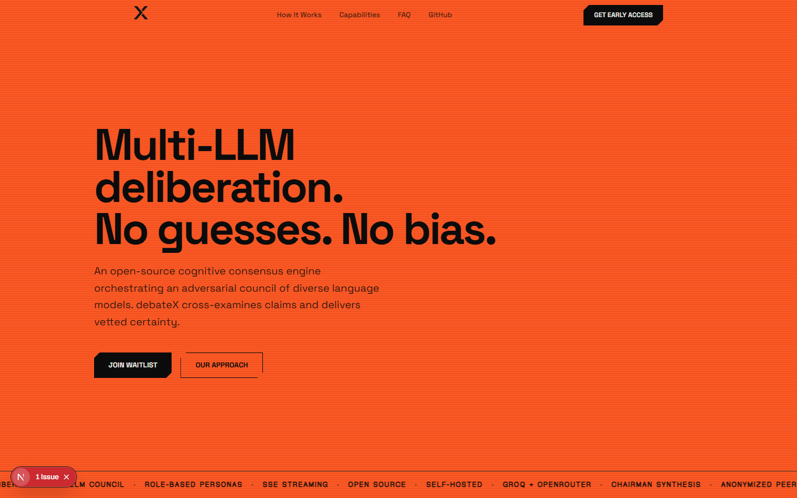
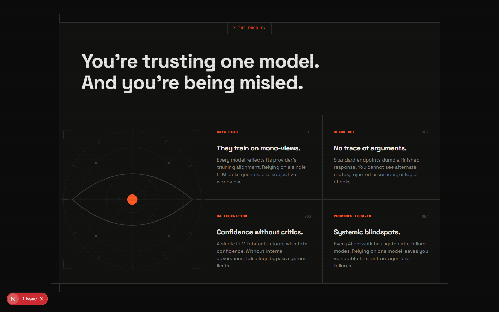
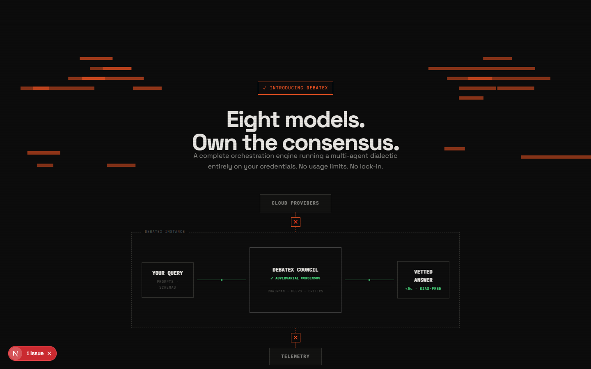

# debateX Landing Page

An open-source cognitive consensus engine orchestrating an adversarial council of diverse language models. debateX cross-examines claims and delivers vetted certainty.

## Features

- **Multi-LLM Deliberation:** Harnesses multiple language models to debate and arrive at a consensus.
- **Sleek UI:** Modern, dark-themed interface with vibrant accents and micro-animations.
- **Responsive Design:** Fully responsive layout built with CSS variables and flexbox/grid.

## Architecture

At the core of debateX lies the **DebateX Council**, a central engine that orchestrates multiple LLMs to deliberate over complex prompts.

## Getting Started

1. Clone the repository.
2. Run `npm install` to install dependencies.
3. Start the development server with `npm run dev`.
4. Open [http://localhost:3000](http://localhost:3000) with your browser to see the result.

## Tech Stack

- **Framework:** Next.js
- **Styling:** Vanilla CSS with custom design tokens
- **Font:** Space Grotesk and JetBrains Mono

## License

MIT License
