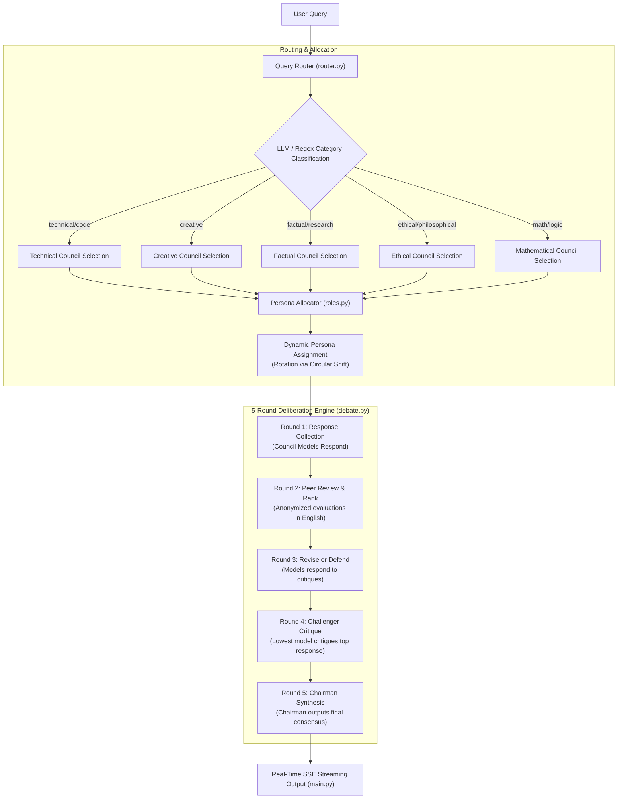
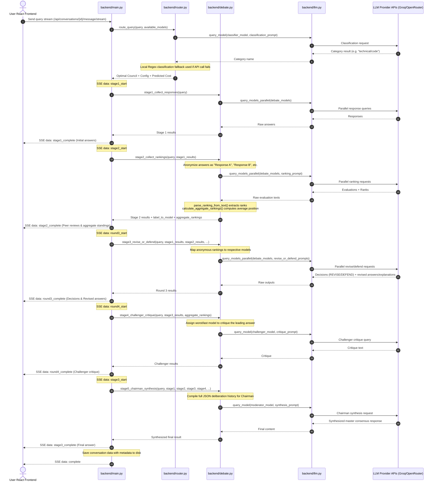

# debateX: Technical Architecture and Deliberation Engine

`debateX` is a production-ready, self-hosted multi-LLM deliberation platform designed to produce high-confidence consensus answers by orchestrating a dynamic council of language models. Rather than relying on a single model's isolated perspective, the platform feeds queries through a rigorous anonymized multi-round cognitive debate. During this process, models cross-examine peer responses, challenge assumptions, revise their stances, and synthesize a final consensus via a designated Chairman.

---

## 🏗️ System Architecture & Directory Structure

The repository is cleanly split into a **Python/FastAPI** backend and a **Vite/React** frontend. The workspace structure is organized as follows:

```
debateX/
├── backend/                  # FastAPI Backend Orchestration
│   ├── config.py             # Model registrations, endpoint configurations, directories
│   ├── debate.py             # 5-Round orchestration pipeline, de-anonymization & parsing
│   ├── groq.py               # Groq provider API client & error prefix handling
│   ├── llm.py                # Facade mapping model names to Groq or OpenRouter client
│   ├── main.py               # FastAPI server, CORS, SSE / streaming routing endpoints
│   ├── openrouter.py         # OpenRouter provider API client
│   ├── roles.py              # Specialized cognitive prompts & deterministic persona rotation
│   ├── router.py             # Category router, pricing table, & predicted cost calculator
│   └── storage.py            # JSON conversation persistence (data/conversations/)
├── frontend/                 # React Frontend Client
│   ├── src/
│   │   ├── components/       # UI components (Sidebar, ChatInterface, Stage1/2/3)
│   │   ├── App.css           # Global layout classes
│   │   ├── App.jsx           # Main state coordinator & SSE stream listener
│   │   ├── api.js            # HTTP and Server-Sent Events client
│   │   ├── index.css         # Dark theme typography, styling tokens, and scrollbars
│   │   └── main.jsx          # React app entry point
│   ├── package.json          # Vite + React 19 dependencies
│   └── vite.config.js        # Vite compilation configuration
├── openspec/                 # OpenSpec specifications library
├── tests/                    # Unit & integration verification test suites
│   ├── test_groq.py          # Validates Groq completions & backend facade routing
│   ├── test_roles.py         # Validates circular shifts & persona prompt assignments
│   └── test_router.py        # Validates regex fallbacks & cost calculators
├── CLAUDE.md                 # Technical notes and development command references
├── debateX.md                # Workspace modifications change log
├── pyproject.toml            # Python packaging and uv dependencies configuration
├── run.bat                   # Windows batch script for one-click startup (FastAPI + Vite)
└── start.sh                  # Unix/macOS script for one-click startup (FastAPI + Vite)
```

---

## 🔄 The 5-Round Deliberation Pipeline

The central core of `debateX` is a multi-round debate engine designed to maximize answer accuracy and eliminate provider bias. The pipeline operates as follows:



### Detailed Breakdown of Deliberation Rounds

#### 1. Round 1: Initial Responses
* **Logic**: Participating council models receive the raw user prompt and generate independent, blind initial answers.
* **Goal**: Capture a broad set of perspectives without models influencing each other.

#### 2. Round 2: Anonymized Peer Review & Ranking
* **Logic**: The backend anonymizes Round 1 responses as `Response A`, `Response B`, `Response C`, etc.
* **Process**: Each model receives the anonymized list and evaluates what each response does well or poorly. Finally, they provide a strict ranking of the responses (e.g., `FINAL RANKING: 1. Response C, 2. Response A`).
* **Aggregate Standings**: The engine parses the rankings from text using regex (`parse_ranking_from_text()`) and calculates an average rank position (`calculate_aggregate_rankings()`) for each model (lower averages indicate higher quality).
* **Bias Prevention**: Anonymization ensures models do not favor their own outputs or other models by provider name.

#### 3. Round 3: Defend or Revise
* **Logic**: Council models are shown the anonymized initial answers, their peers' evaluations, and the aggregate standings.
* **Process**: Models recognize their own initial answer label (e.g., `Response A`). They must choose to either **REVISE** their answer to fix valid criticisms or **DEFEND** their original stance if they believe the criticisms are incorrect.
* **Output**: Responses are prefixed with a decision header (`DECISION: REVISE` or `DECISION: DEFEND`) followed by the updated answer or defensive explanation.

#### 4. Round 4: Challenger Critique
* **Logic**: The engine designates a specific challenger model (typically the lowest-ranked model from Round 2, ensuring it is different from the leading model).
* **Process**: The challenger is tasked with aggressively finding flaws, edge cases, vulnerabilities, or incorrect assumptions in the current leading answer (the top-ranked answer from Round 3).

#### 5. Round 5: Chairman Synthesis
* **Logic**: The designated **Chairman (Moderator)** ingests the entire history of the preceding rounds (compiled as a structured JSON transcript).
* **Process**: The Chairman weighs the initial answers, reviews, revisions/defenses, and the Challenger's critique. It resolves conflicts, addresses the Challenger's arguments, and synthesizes the final, definitive response in English.

---

## 🎭 Dynamic Cognitive Persona Allocation (`backend/roles.py`)

To ensure multi-faceted critique, the platform dynamically assigns behavioral personas to council models depending on the classified query type.

### Persona Descriptions
* **Reasoner (Lead)**: Prompts models to think step-by-step to draft analytical, structured, and logical drafts.
* **Devil's Advocate**: Prompts models to aggressively challenge consensus, uncover edge cases, memory leaks, narrative clichés, or logical flaws.
* **Fact-Checker**: Directs models to verify API signatures, dependencies, names, dates, or formulas. Equipped with a search tool.
* **Steelmanner**: Instructs models to strengthen competing proposals, completing missing gaps or refining logic for a fairer assessment.
* **Chairman**: Responsible for moderating, weighing arguments, and synthesizing the definitive answer.

### Circular Role Rotation
To keep assignments fair and cover diverse aspects, the platform rotates personas deterministically based on the query index:
$$\text{shift} = \text{query\_index} \pmod N$$
where $N$ is the number of available models. The list of models is rotated by this offset before roles are allocated.
* **1 Model**: Solo model acts as `Chairman`.
* **2 Models**: Classic dialectic: `Chairman` and `Devil's Advocate`.
* **3 Models**: `Chairman`, `Devil's Advocate`, and `Reasoner`.
* **4 Models**: `Chairman`, `Devil's Advocate`, `Reasoner`, and `Fact-Checker`.
* **5+ Models**: Full assignment: `Chairman`, `Devil's Advocate`, `Fact-Checker`, `Steelmanner`, and the remaining models act as `Reasoners`.

---

## 🎯 Dual-Path Query Routing & Cost Estimation (`backend/router.py`)

To optimize latency, model selection, and resource usage, `debateX` runs a dual-path classification workflow.

### 1. Classification
* **Fast LLM Path**: The engine routes the query to a fast, free LLM (or moderator fallback) to classify the user query into one of 5 types: `technical/code`, `creative`, `factual/research`, `ethical/philosophical`, or `math/logic`.
* **Local Regex Fallback**: If the LLM query times out or fails, a local keyword-matching algorithm classifies the query using regex mapping (e.g. matching `python`, `api` for technical; `story`, `novel` for creative).

### 2. Council Selection
Based on the category, the optimal council is chosen:
* **`technical/code`**: Mandates a disagreement panel and fact-checker web access; recruits programming-heavy models (llama-3.3, gpt-oss, qwen, deepseek).
* **`creative`**: Bypasses disagreement panels; recruits context-rich and creative models (gpt-oss, qwen, glm-4.5).
* **`factual/research`**: Mandates a disagreement panel and search access; recruits high-precision models (llama-3.3, qwen, gpt-oss, deepseek).
* **`ethical/philosophical`**: recruits expressive, highly articulate reasoning models (gpt-oss, llama-3.3, glm-4.5).
* **`math/logic`**: recruits reasoning and proof-capable nodes (llama-3.3, deepseek, llama-3.1, qwen).

### 3. Predicted Cost Calculation
Estimated costs are calculated in USD using pricing parameters per 1M tokens across the 5 rounds:
$$\text{Predicted Cost} = \sum_{m \in \text{Council}} \text{Cost}(m, 5000, 2500) + \text{Cost}(\text{Challenger}, 3500, 800) + \text{Cost}(\text{Chairman}, 6000, 1500)$$
where $\text{Cost}(M, I, O)$ calculates model $M$'s cost for input tokens $I$ and output tokens $O$.

---

## 🔌 API & Frontend Coordination



### 1. FastAPI endpoints (`backend/main.py`)
* **GET `/api/conversations`**: Returns metadata list of conversations (IDs, creation timestamp, titles, message counts), filtering out empty ones.
* **POST `/api/conversations`**: Creates and instantiates a new JSON file under `data/conversations/`.
* **POST `/api/conversations/{id}/message/stream`**: Establishes a Server-Sent Events (SSE) stream returning JSON packets as each stage completes:
  * `stage1_start` / `stage1_complete` (Initial responses)
  * `stage2_start` / `stage2_complete` (Anonymized peer reviews + rankings)
  * `round3_start` / `round3_complete` (Revise or Defend outputs)
  * `round4_start` / `round4_complete` (Challenger critique)
  * `stage3_start` / `stage3_complete` (Final synthesis) *[Note: stage3 represents the legacy 3rd stage for backwards-compatibility]*
  * `title_complete` (Saves generated short title)
  * `complete` (Success)
  * `error` (Graceful client-side rendering of model/provider exceptions)

### 2. Client Side Management (`frontend/src/App.jsx` & `frontend/src/api.js`)
* **SSE Stream Consumption**: The client parses chunks from `fetch` reader stream (`TextDecoder` + line buffer parsing) and triggers the `onEvent` handler.
* **Client-Side De-Anonymization**: The UI receives completely anonymized critique texts from Stage 2. However, the client-side UI uses the `label_to_model` mapping to show human-readable model names on labels (e.g. replacing "Response A" with "**groq/openai/gpt-oss-120b**") for the dashboard user, maintaining strict blindness for the participating models.
* **State Sync**: Message metadata (label mappings, peer ranks, cost stats) are stored in App state and rendered within tab panels, before uvicorn/storage serialize the complete object.

---

## 🛠️ Verification & Testing

DebateX provides automated unit tests to verify system soundness:
* **`tests/test_roles.py`**: Assures that deterministic Circular Role Rotation is functional, role arrays are properly bound, and the output prompts are specialized.
* **`tests/test_router.py`**: Verifies that classification mappings work as expected, falls back to regex matching on network/mock exceptions, and correctly forecasts predicted costs.
* **`tests/test_groq.py`**: Validates Groq API integration and client response parsing.

---

## 🚀 Environment and Launch Configurations

### 1. Prerequisites
* Python 3.11+
* Node.js v18+
* `uv` Package Manager (recommended for extremely fast dependency installation)

### 2. Port Bindings
* **FastAPI Backend**: `http://localhost:8001` (specifically moved from `8000` to prevent localhost collisions).
* **Vite React Frontend**: `http://localhost:5173`.
* **CORS Configuration**: Explicitly permits requests originating from frontend origins (`localhost:5173`, `localhost:3000`).

### 3. Service Providers
* **Groq Cloud API**: Low-latency, high-performance models (`llama-3.3-70b-versatile`, `gpt-oss-120b`, `qwen3-32b`, `llama-3.1-8b-instant`).
* **OpenRouter API (Free Tier fallback)**: Diverse context nodes (`deepseek-v4-flash`, `glm-4.5-air`, `lfm-2.5-1.2b`, `nemotron-3-nano`).
